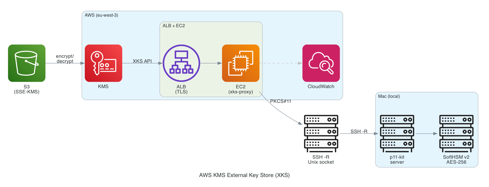

# AWS KMS External Key Store (XKS) POC

Proof of concept demonstrating AWS KMS encryption backed by a local SoftHSM key, using the [XKS Proxy API](https://docs.aws.amazon.com/kms/latest/developerguide/keystore-external.html).

## Motivation

The initial intent was to back AWS KMS with a hardware security module (HSM) under my physical control. The goal is to demonstrate that the cryptographic master key lives on a machine I fully own -- not in AWS, not in a managed service, but on my personal hardware.

SoftHSM on a local machine serves as a stand-in for a real HSM for this POC. The EC2 instance and SSH reverse tunnel exist only because AWS KMS requires an HTTPS endpoint with a valid TLS certificate to reach the XKS proxy. The EC2+ALB setup is the simplest way to provide that. The actual key material never leaves the local machine.

## Architecture



When you upload a file to S3 with `--sse aws:kms`, KMS calls the xks-proxy's `/encrypt` endpoint. The proxy performs AES-256-GCM encryption via PKCS#11, remoted to SoftHSM on your machine through p11-kit over an SSH tunnel. Decryption follows the reverse path.

## Components

| Component | Location | Purpose |
|-----------|----------|---------|
| `cloudformation.yaml` | This repo | EC2 + ALB + Route53 + CloudWatch |
| `configuration/settings.toml` | This repo | xks-proxy runtime config |
| `create.sh` | This repo | One-shot deploy script |
| `xks-proxy` | [aws-kms-xks-proxy](../aws-kms-xks-proxy/xks-axum/) | AWS XKS proxy (Rust, forked) |
| SoftHSM v2 | Machine (Homebrew) | Software HSM holding the AES-256 key |
| p11-kit 0.26.2 | Machine + EC2 | PKCS#11 remoting over Unix sockets |

## Prerequisites

The XKS proxy is built from [aws-samples/aws-kms-xks-proxy](https://github.com/aws-samples/aws-kms-xks-proxy), AWS's reference implementation written in Rust. Cross-compilation for ARM64 Linux uses `cargo-zigbuild`.

**Machine (local):**
```bash
brew install softhsm p11-kit
brew install zig
cargo install cargo-zigbuild
```

**AWS:**
- Route53 hosted zone for your domain
- EC2 key pair in the target region
- A KMS External Key Store already created (custom key store ID needed)

## Setup

### 1. Create the SoftHSM AES-256 key

```bash
# Initialize a SoftHSM token named "foo"
softhsm2-util --init-token --slot 0 --label foo --pin 1234 --so-pin 0000

# Find the assigned slot number
softhsm2-util --show-slots
# Note the slot ID (e.g., 0x4d6e39bb)

# Generate an AES-256 key with label "foo" in that slot
pkcs11-tool --module /opt/homebrew/lib/softhsm/libsofthsm2.so \
  --login --pin 1234 \
  --keygen --key-type AES:32 --label foo \
  --token-label foo

# Verify the key exists
pkcs11-tool --module /opt/homebrew/lib/softhsm/libsofthsm2.so \
  --login --pin 1234 \
  --list-objects --type secrkey
```

Expected output:
```
Secret Key Object; AES length 32
  label:      foo
  Usage:      encrypt, decrypt, sign, verify, wrap, unwrap
  Access:     never extractable, local
```

### 2. Deploy the infrastructure

```bash
./create.sh
```

This script:
- Cross-compiles xks-proxy for aarch64 via `cargo zigbuild`
- Creates/updates the CloudFormation stack (ALB, EC2, Route53, CloudWatch)
- SCPs the binary and `settings.toml` to the EC2 instance
- Starts the xks-proxy systemd service

### 3. Upgrade p11-kit on EC2 (one-time)

The AL2023 repo ships p11-kit 0.24.1, which lacks AES-GCM RPC serialization. Version 0.26.2 is required. Build from source on EC2:

```bash
ssh -i ~/Downloads/EC2Tutorial2.pem ec2-user@<EC2_IP>

# Install build deps
sudo dnf install -y meson ninja-build gcc libtasn1-devel libffi-devel

# Build and install p11-kit 0.26.2
cd /tmp
curl -sL https://github.com/p11-glue/p11-kit/releases/download/0.26.2/p11-kit-0.26.2.tar.xz | tar xJ
cd p11-kit-0.26.2
meson setup _build --prefix=/usr --libdir=/usr/lib64 \
  -Dtrust_paths=/etc/pki/ca-trust/source:/usr/share/pki/ca-trust-source
ninja -C _build -j1    # -j1 required: t4g.nano has only 512MB RAM
sudo ninja -C _build install

# Verify
ls -la /usr/lib64/pkcs11/p11-kit-client.so
```

Also configure sshd for socket forwarding (if not already done by UserData):
```bash
sudo bash -c 'echo "StreamLocalBindUnlink yes" >> /etc/ssh/sshd_config'
sudo systemctl restart sshd
```

### 4. Start the PKCS#11 tunnel

**Terminal 1 (Machine) -- p11-kit server:**
```bash
p11-kit server --provider /opt/homebrew/lib/softhsm/libsofthsm2.so "pkcs11:"
```

Note the `P11_KIT_SERVER_ADDRESS` from the output (e.g., `unix:path=/var/folders/.../pkcs11-XXXX`).

**Terminal 2 (Machine) -- SSH reverse tunnel:**
```bash
export P11_KIT_SERVER_ADDRESS=unix:path=/var/folders/.../pkcs11-XXXX  # from above

ssh -i ~/Downloads/EC2Tutorial2.pem \
  -R /home/ec2-user/.p11-kit.sock:${P11_KIT_SERVER_ADDRESS#unix:path=} \
  ec2-user@<EC2_IP>
```

This forwards the EC2 Unix socket to the Machine's p11-kit server socket.

### 5. Verify the PKCS#11 tunnel

**On EC2 (via the SSH session):**
```bash
# List tokens visible through p11-kit remoting
P11_KIT_SERVER_ADDRESS=unix:path=/home/ec2-user/.p11-kit.sock \
  pkcs11-tool --module /usr/lib64/pkcs11/p11-kit-client.so --list-slots

# List the AES key
P11_KIT_SERVER_ADDRESS=unix:path=/home/ec2-user/.p11-kit.sock \
  pkcs11-tool --module /usr/lib64/pkcs11/p11-kit-client.so \
  --login --pin 1234 --list-objects --type secrkey

# Test encryption through the tunnel
echo "test" > /tmp/test.bin
P11_KIT_SERVER_ADDRESS=unix:path=/home/ec2-user/.p11-kit.sock \
  pkcs11-tool --module /usr/lib64/pkcs11/p11-kit-client.so \
  --encrypt --mechanism AES-CBC-PAD --iv '00000000000000000000000000000000' \
  --login --pin 1234 --label foo \
  --input-file /tmp/test.bin --output-file /tmp/cipher.bin
```

### 6. Restart xks-proxy and test

```bash
# On EC2
sudo systemctl restart xks-proxy

# From Machine -- health check
curl https://xks.lemaire.tel/ping
# Expected: pong from xks-proxy v3.1.2-unknown

# Create a KMS key backed by SoftHSM
aws kms create-key --region eu-west-3 \
  --origin EXTERNAL_KEY_STORE \
  --custom-key-store-id cks-feecd7302f6022bf1 \
  --xks-key-id foo

# Encrypt a file to S3 using the XKS key
echo "hello from softhsm" > /tmp/test.txt
aws s3 cp /tmp/test.txt s3://xks-proxy-poc-test/test.txt \
  --region eu-west-3 \
  --sse aws:kms \
  --sse-kms-key-id cd0608a9-0726-4187-b1b1-d0b08370d8f9

# Download and verify (decryption goes through SoftHSM)
aws s3 cp s3://xks-proxy-poc-test/test.txt /tmp/downloaded.txt --region eu-west-3
cat /tmp/downloaded.txt
# Expected: hello from softhsm

# Check CloudWatch logs
aws logs tail /xks-proxy/ec2 --region eu-west-3 --follow
```

## xks-proxy code change

A bug fix was applied to `aws-kms-xks-proxy/xks-axum/src/xks_proxy/handlers/get_key_meta_data.rs`.

**Problem:** The `GetKeyMetadata` handler declares stack variables as immutable (`let key_type = 0;`) and passes pointers to them via `set_ck_ulong()` for `C_GetAttributeValue` to write into. The C function writes the correct values (e.g., `key_type=31` for CKK_AES), but the Rust compiler's release-mode optimizer treats the immutable bindings as compile-time constants and inlines `0` wherever they're subsequently read. This caused `keyspec(0, 0)` = `"RSA_0"` instead of `keyspec(31, 32)` = `"AES_256"`, and KMS rejected the key.

**Fix:** Use `std::ptr::read_volatile` after `C_GetAttributeValue` to force the compiler to re-read from actual memory:

```rust
// After C_GetAttributeValue completes:
let key_type = unsafe { std::ptr::read_volatile(&key_type) };
let key_size = unsafe { std::ptr::read_volatile(&key_size) };
let can_encrypt = unsafe { std::ptr::read_volatile(&can_encrypt) };
let can_decrypt = unsafe { std::ptr::read_volatile(&can_decrypt) };
let can_sign = unsafe { std::ptr::read_volatile(&can_sign) };
let can_verify = unsafe { std::ptr::read_volatile(&can_verify) };
let can_wrap = unsafe { std::ptr::read_volatile(&can_wrap) };
let can_unwrap = unsafe { std::ptr::read_volatile(&can_unwrap) };
```

This is a Rust undefined behavior issue: writing through a raw pointer derived from an immutable reference. The proper long-term fix would be to use `UnsafeCell` or `MaybeUninit` in the `rust-pkcs11` crate's `CK_ATTRIBUTE::set_ck_ulong` implementation.

## p11-kit version requirements

| Version | AES-GCM RPC | Object handles | Status |
|---------|-------------|----------------|--------|
| 0.24.1 (AL2023 repo) | No | N/A | `CKR_MECHANISM_INVALID` |
| 0.25.x | Yes | Broken across sessions | `CKR_OBJECT_HANDLE_INVALID` |
| 0.26.2 | Yes | Works | Working |

**The p11-kit version must match on both ends.** A version mismatch between client (EC2) and server (Machine) causes RPC protocol errors (`CKR_OBJECT_HANDLE_INVALID`, `CKR_DEVICE_ERROR`). Both must be v0.26.2. The local machine's `brew install p11-kit` provides 0.26.2. The EC2 instance requires building from source (see step 3 above).

## Security analysis: what XKS does and does not protect

### XKS does protect against

- **Future unauthorized access by AWS:** If you revoke XKS access (disconnect the tunnel, shut down the proxy), AWS cannot decrypt data going forward. This only applies to new decryption requests -- if AWS cached data encryption keys (DEKs), already-encrypted objects remain accessible with those cached keys.

- **Regulatory and sovereignty requirements:** Demonstrates that cryptographic master keys remain under your control, in your own infrastructure. Provides an audit trail of all key operations (visible in your p11-kit server / HSM logs and CloudWatch).

- **Cloud provider key management concerns:** If you don't trust AWS's key storage practices or want keys in your own HSMs/key managers, XKS keeps the master key material entirely outside AWS.

### XKS does not protect against

- **AWS actively retaining or exfiltrating your data:** If AWS were malicious, they could copy plaintext data before encryption or retain DEKs despite claiming they don't. XKS protects the master key, not the data in transit through AWS services.

- **Legal compulsion for data at rest:** If DEKs were retained in AWS systems, AWS could be compelled to produce them. XKS only helps if DEKs are truly ephemeral within AWS.

- **Retrospective decryption of previously accessed data:** If AWS legitimately decrypted an object (e.g., serving a GET request), they could have retained the plaintext. XKS does not protect against historical access.

### Bottom line

All cloud providers share the same fundamental limitation. External key management (XKS, EKM, BYOK) is about:

- **Governance and compliance** -- demonstrable control over key material
- **Operational flexibility** -- key portability and revocation
- **Trust reduction** -- limits what the provider can do going forward

It is NOT about:

- **Protecting against a malicious provider** -- they see plaintext anyway
- **Absolute cryptographic guarantees** -- still requires trusting the implementation
- **Legal immunity** -- laws still apply to the data the provider has handled

**Choose external key management when:** compliance requires it, you want operational control, or you need key portability between providers.

**Don't rely on it when:** the cloud provider itself is your threat model -- in that case, use client-side encryption before uploading, or don't use cloud.

## Cloud provider comparison

### AWS -- External Key Store (XKS)

**DIY implementation: YES -- open specification, reference implementation provided.**

AWS publishes the [XKS Proxy API specification](https://github.com/aws/aws-kms-xksproxy-api-spec?tab=readme-ov-file) and a reference implementation. You can build your own proxy backed by any PKCS#11-compatible HSM or key manager. AWS isn't locking you into certified vendors.

What AWS provides:
- Open API specification (public GitHub repo)
- Reference proxy implementation (Rust)
- Freedom to use any HSM, software token, or key manager
- Certified partner integrations available but not required

### GCP -- Cloud External Key Manager (EKM)

**DIY implementation: NO -- partner required.**

GCP Cloud EKM requires customers to use keys managed within a supported external key management partner. While you can connect via the internet or VPC, you must use certified partner solutions.

What GCP provides:
- No public API specification
- No reference implementation
- No way to build your own integration
- Keys can be external (via partners only)
- VPC or internet connectivity options

Required certified partners: Thales CipherTrust, Fortanix DSM.

### Azure -- No external key store equivalent

**DIY implementation: N/A -- no external key store feature.**

What Azure provides:
- No external key store feature (like AWS XKS)
- No external key manager integration (like GCP EKM)
- **BYOK:** import keys TO Azure (keys end up IN Azure)
- **Managed HSM:** single-tenant HSM in Azure datacenters
- **Dedicated HSM:** Thales Luna in Azure (expensive, still in Azure)

Azure's approach focuses on single-tenant Managed HSM with FIPS 140-3 Level 3 validation using confidential computing and Trusted Execution Environments, keeping everything within Azure's infrastructure.

## Files

```
aws-kms-xks-poc/
  cloudformation.yaml          # EC2 + ALB + Route53 + CloudWatch
  configuration/settings.toml  # xks-proxy config (PKCS#11 module, SigV4 creds, etc.)
  create.sh                    # One-shot deploy script
  README.md                    # This file
```
